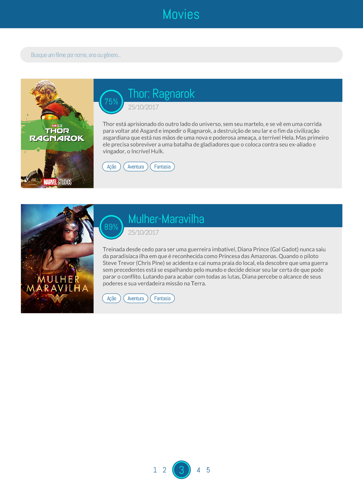
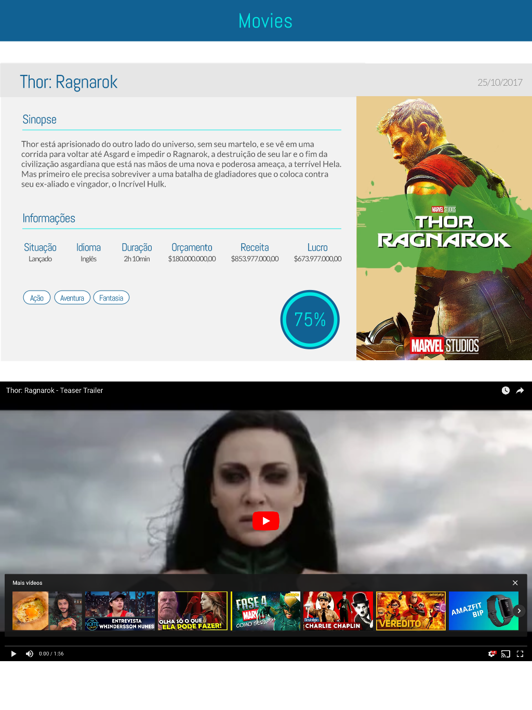

# Movie Finder

Web app responsivo que consume a [API do The Movie DB](https://www.themoviedb.org/documentation/api) e permite buscar e ver detalhes de filmes de seu catálogo.

## Especificações

-   Ter as seguintes funcionalidades:
    -   Permitir buscar filmes por nome ou gênero
    -   Resultados de busca paginados, 5 por página
    -   Exibir nos resultados da busca: nome, cartaz, data de lançamento, sinopse e pontuação do filme
    -   Possa ver, ao clicar em um resultado da busca, detalhes do filme além dos mostrados na busca, como: status (lançado, previsto, etc), idioma, duração, orçamento, receita, lucro, categorias e trailer, quando disponíveis.
-   Ser responsivo
-   Ter boa performance
-   Funcionar na última versão dos principais browsers (Chrome, Firefox, Safari e Edge)
-   Reproduzir os layouts a seguir:

> Resultados de busca:
> 

---

> Detalhes de filme:
> 

## Clonando o projeto

Para clonar o projeto, basta rodar o seguinte comando no terminal: `git clone https://github.com/maxarouca/movie_finder`.

## Rodando o projeto

Antes de iniciar o projeto, é necessário instalar as dependências. Isso pode ser feito por meio do comando `yarn install`.

Após a instalação das dependências, iniciaremos o projeto com o comando: `yarn start`
